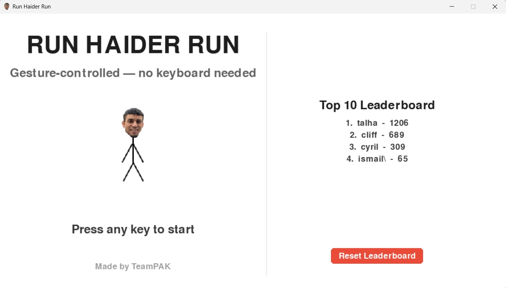
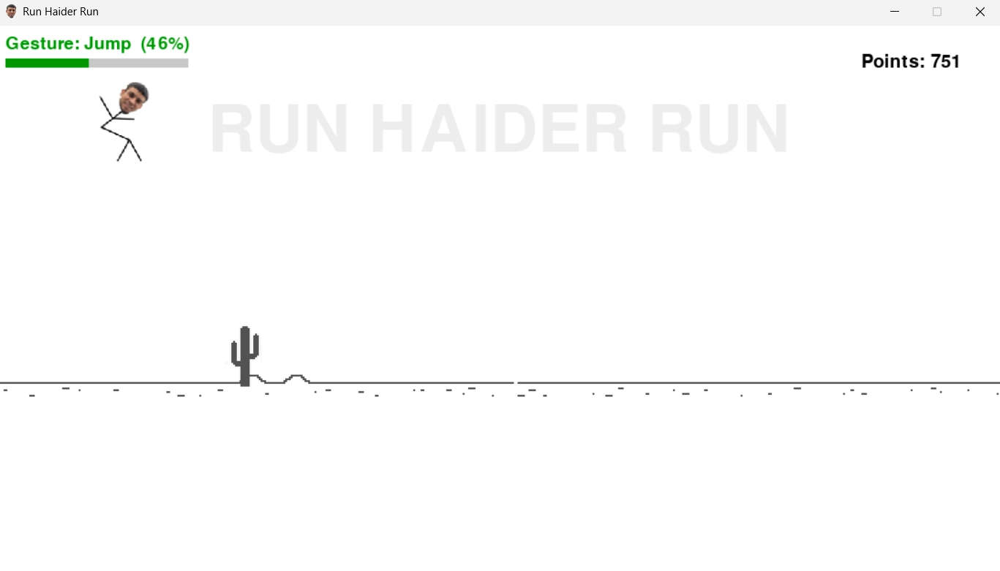
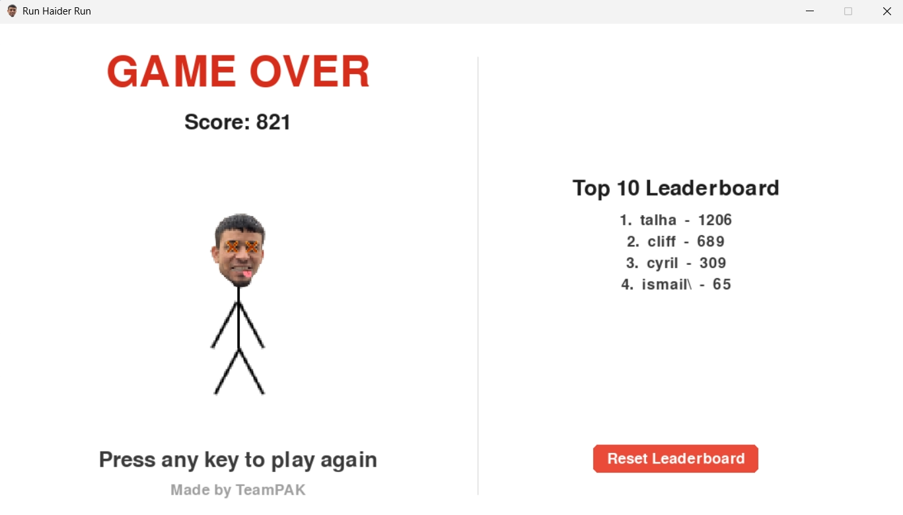

# Run Haider Run

**AI Gesture-Controlled Endless Runner** by TeamPAK

---

## Screenshots

| Start Screen                                |
| ------------------------------------------- |
|  |

| Gameplay                              |
| ------------------------------------- |
|  |

| Game Over                                    |
| -------------------------------------------- |
|  |

---

## Controls

| Gesture         | Action |
| --------------- | ------ |
| Neutral         | Run    |
| Raise both arms | Jump   |
| Cross arms low  | Duck   |

---

## Setup

**Requirements:** Python 3.10–3.12, webcam

```bash
git clone https://github.com/Talha-Arif-ACS/run-haider-run.git
cd run-haider-run
pip install pygame opencv-python numpy ai-edge-litert streamlit
python main.py
```

> The trained gesture model is included - no additional setup required.

---

## Tech Stack

`Pygame` · `Teachable Machine (TFLite)` · `OpenCV` · `Python`

---

`v1.0.0` — TeamPAK
